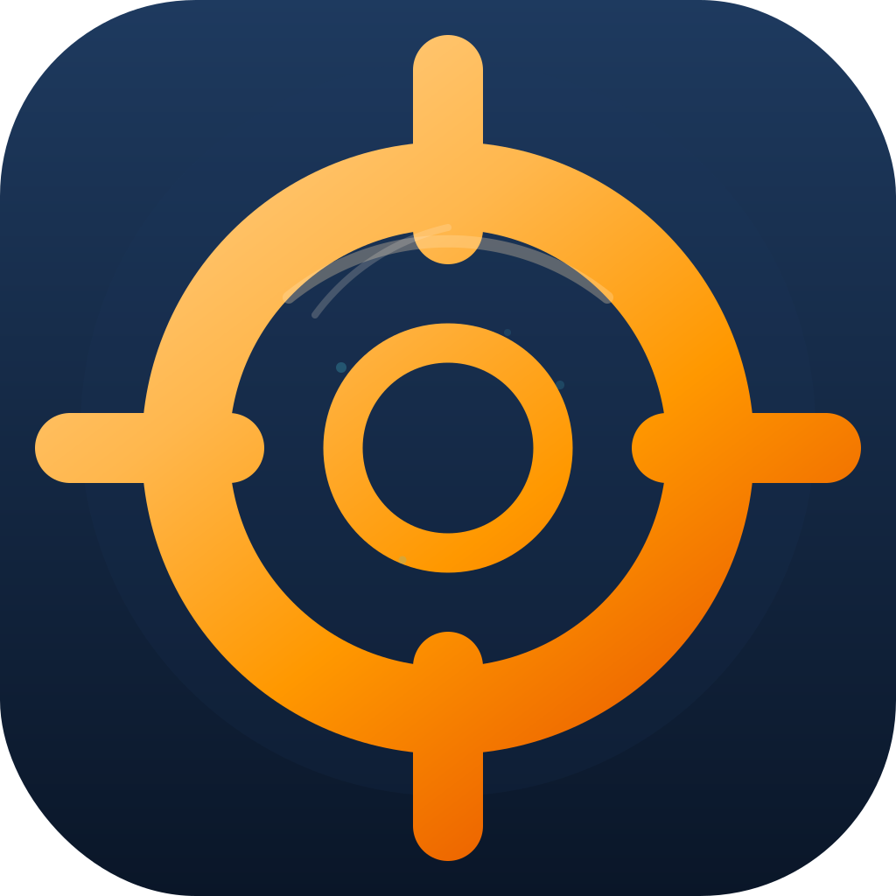
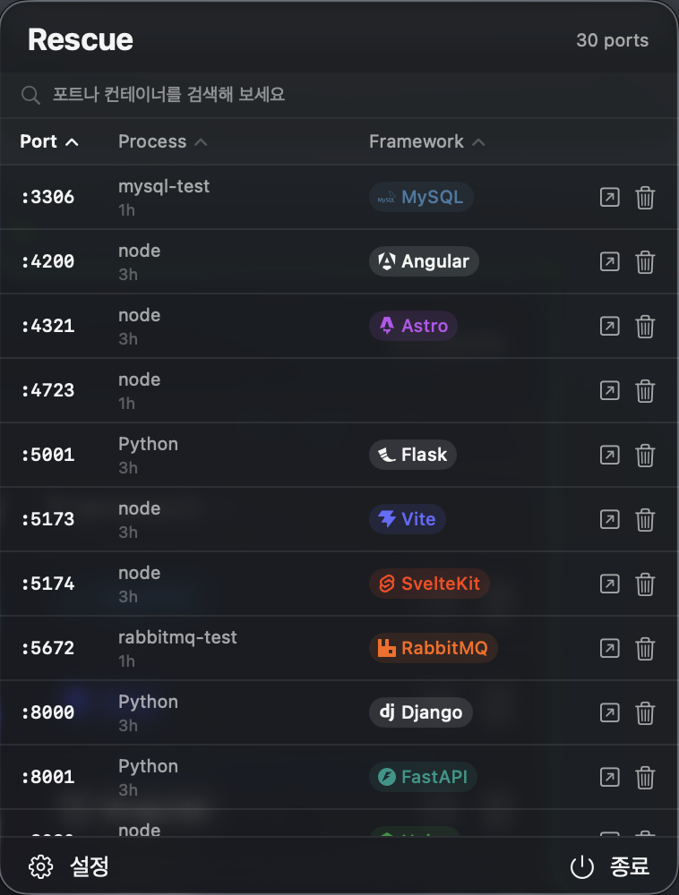
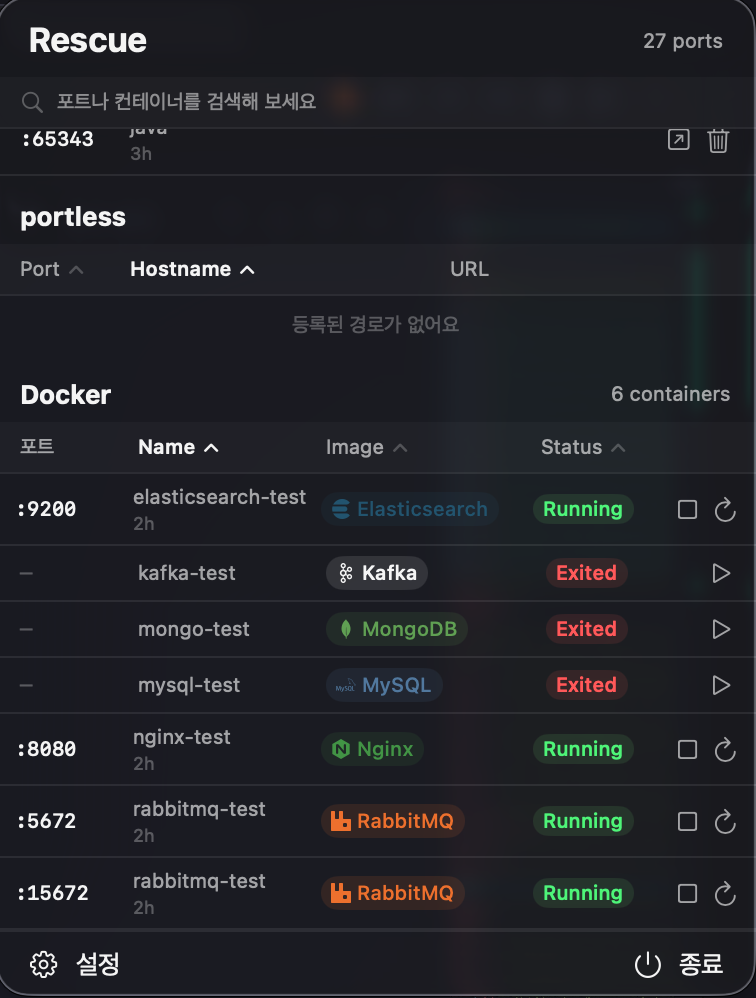

<p align="right">
  <a href="README.md">English</a>
</p>

# Rescue

<p align="center">
  
</p>

<p align="center">
  <strong>켜놓고 잊어버린 개발 프로세스를 찾아 관리합니다.</strong>
</p>

<p align="center">
  
  
  <a href="LICENSE"></a>
</p>

<br />

> *켜놓고 잊어버린 프로세스들을 구합니다.*

개발하다 보면 고아 프로세스가 쌓입니다. 어젯밤 켜둔 Vite 서버, 지난주에 띄운 PostgreSQL 컨테이너, 이미 꺼진 줄 알았던 Redis 인스턴스 — 이것들이 메모리를 잡아먹고, 포트를 붙들고, 원인 모를 충돌을 만들어냅니다.

Rescue가 그것들을 찾아내 한곳에 보여줍니다. 문제가 되기 전에 직접 처리하세요.

<p align="center">
  
  &nbsp;&nbsp;
  
</p>

---

## 설치

### 다운로드

1. [최신 릴리스](https://github.com/kim-yeonjoong/rescue/releases/latest)에서 `Rescue-macos.zip`을 다운로드합니다
2. 압축을 풀고 `Rescue.app`을 `/Applications`(응용 프로그램)으로 이동합니다
3. 처음 실행 시 Apple Developer ID로 서명되지 않아 macOS가 앱을 차단합니다. 다음 중 한 가지로 허용할 수 있습니다:
   ```bash
   xattr -d com.apple.quarantine /Applications/Rescue.app
   ```
   또는 **시스템 설정 → 개인정보 보호 및 보안 → 보안**에서 **그래도 열기**를 클릭합니다.

### 소스에서 빌드

```bash
git clone https://github.com/kim-yeonjoong/rescue.git
cd rescue/apps/rescue
swift build -c release
```

빌드된 바이너리 위치: `.build/arm64-apple-macosx/release/Rescue`

---

## 사용법

Rescue는 메뉴바에 상주합니다.

아이콘을 클릭하면 패널이 열립니다:

- **포트 목록** — 포트 번호, 프로세스 이름, 프레임워크 아이콘, 업타임 표시
  - 링크 아이콘 클릭 → 브라우저에서 열기
  - 휴지통 아이콘 클릭 → 프로세스 종료 (확인 필요)
  - 우클릭 → 포트 복사, URL 복사 등 추가 옵션
- **portless 섹션** — [portless](https://github.com/vercel-labs/portless)에 등록된 호스트명 라우트 표시 (portless 설치 필요)
- **Docker 섹션** — 전체 컨테이너 목록; 클릭하여 시작/중지/재시작
- **검색창** — 모든 섹션을 동시에 필터링
- **하단바** — 설정(기어)과 종료(전원) 버튼

## 주요 기능

- **포트 스캔** — `lsof`를 통해 TCP LISTEN 상태의 포트를 실시간으로 표시, 갱신 주기 설정 가능
- **프레임워크 감지** — 프로세스 명령어와 포트/이름 휴리스틱으로 31개 프레임워크 자동 식별
- **Docker 통합** — 실행 중인 컨테이너와 매핑된 포트 표시; 메뉴바에서 시작/중지/재시작
- **portless 통합** — [portless](https://github.com/vercel-labs/portless)에서 등록한 호스트명 별칭을 포트 옆에 표시
- **프로세스 종료** — 메뉴바에서 바로 프로세스 kill
- **브라우저 열기** — `localhost:<port>` 또는 portless URL을 기본 브라우저로 열기
- **복사** — 우클릭 컨텍스트 메뉴로 포트 번호 또는 URL 복사
- **포트 알림** — 새 포트가 열릴 때 시스템 알림
- **업타임 추적** — 각 포트가 열린 시간 표시
- **검색** — 포트 번호, 프로세스 이름, 프레임워크, URL로 필터링
- **정렬** — 포트, 프로세스 이름, 프레임워크 기준 정렬
- **필터** — 특정 프로세스 또는 포트 번호를 목록에서 숨기기
- **슬립/웨이크 대응** — 시스템 슬립 시 폴링 중지, 웨이크 시 재개

## 지원 프레임워크

| 카테고리 | 프레임워크 |
| --- | --- |
| 프론트엔드 | Next.js, Vite, Angular, Vue CLI, Nuxt, Remix, Astro, SvelteKit, Storybook |
| 백엔드 | Express, NestJS, Fastify, Hono, Django, Flask, FastAPI, Rails, Spring Boot, Phoenix |
| 인프라 | Docker, Redis, PostgreSQL, MySQL, MongoDB, Nginx, RabbitMQ, Kafka, Elasticsearch, MinIO |
| 기타 | Hugo, Jupyter |

## 설정

| 항목 | 기본값 | 설명 |
| --- | --- | --- |
| 로그인 시 시작 | 꺼짐 | 로그인 시 Rescue 자동 실행 |
| 포트 알림 | 켜짐 | 새 포트가 열릴 때 시스템 알림 |
| 갱신 주기 | 2.5초 | 포트 스캔 주기 (1~10초) |
| 언어 | 시스템 | 영어 또는 한국어 |
| Docker | 켜짐 | Docker 컨테이너 패널 활성화 |
| portless | 켜짐 | portless 호스트명 패널 활성화 |
| 필터 | — | 목록에서 숨길 프로세스 이름 또는 포트 번호 |

기본 숨김 프로세스: `code helper`, `cursor helper`, `webstorm`, `intellij`, `google chrome`, `chromium`, `safari`, `firefox`, `arc helper`, `brave browser`, `github desktop`, `sourcetree`, `electron`, `slack helper`

---

## 요구 사항

- macOS 14 Sonoma 이상
- Xcode 16 이상 (소스 빌드 시)
- Swift 6.0 이상

## 기여

기여를 환영합니다. 큰 변경 사항은 PR 제출 전에 이슈를 먼저 열어 논의해 주세요.

```bash
cd apps/rescue

# 빌드
swift build

# 테스트
swift test

# 린트 (SwiftLint 필요)
swiftlint lint
```

### 프로젝트 구조

```
apps/rescue/
  Sources/
    Rescue/          # SwiftUI 앱, 뷰, 뷰모델, AppDelegate
    RescueCore/      # 모델, 서비스, 셸 실행기 (UI 의존성 없음)
  Tests/
    RescueCoreTests/ # 코어 서비스 유닛 테스트
```

`RescueCore`는 별도 라이브러리 타겟으로 분리되어 UI 없이 서비스 테스트가 가능합니다.

## 라이선스

[MIT License](LICENSE) © 2026 kim-yeonjoong
